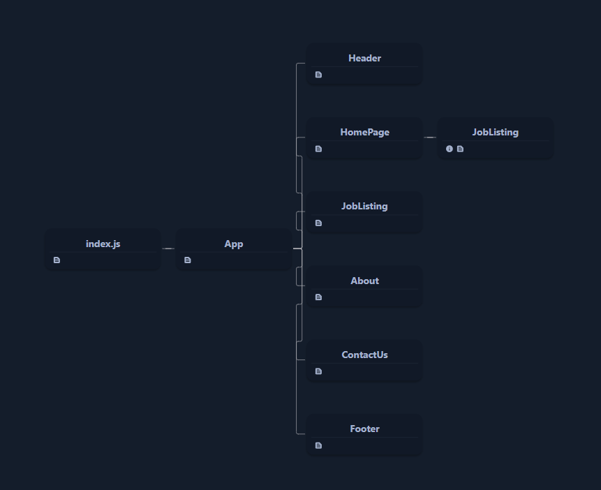

# ZenWork

ZenWork is a web application designed to provide users with a comprehensive platform for exploring job listings, learning about Japanese culture, and contacting the organization. This project is built using React.js and Tailwind CSS.

## Table of Contents

- [Features](#features)
- [Technologies Used](#technologies-used)
- [Installation](#installation)
- [Usage](#usage)
- [Contributing](#contributing)

## Features

### 1. Job Listing

- View a list of available job opportunities.
- Each job listing displays key details such as title, company, location, salary, job type, and description.
- Users can apply for jobs directly through the platform.

### 2. About Japan

- Learn about Japanese culture, cuisine, arts, and modern marvels.
- Explore various aspects of Japanese culture through informative content and beautiful imagery.
- Gain insights into traditional arts, culinary delights, and modern innovations.

### 3. Contact

- Easily reach out to the organization for inquiries or support.
- Access contact information such as address, email, and phone number.
- Use a convenient contact form to send messages directly to the organization.

## Technologies Used

- React.js: A JavaScript library for building user interfaces.
- Tailwind CSS: A utility-first CSS framework for creating custom designs with ease.
- React Router: A library for routing in React applications, used for navigation between different pages.
- React Icons: A collection of popular icons for React applications.

## Installation

To run this project locally, follow these steps:

1. Clone the repository: `git clone <repository-url>`
2. Navigate to the project directory: `cd zenwork`
3. Install dependencies: `npm install`
4. Start the development server: `npm start`
5. Open your browser and visit `http://localhost:3000` to view the application.

## Contributing

Contributions are welcome! If you'd like to contribute to this project, please follow these steps:

1. Fork the repository
2. Create a new branch: `git checkout -b feature-name`
3. Make your changes and commit them: `git commit -m 'Add some feature'`
4. Push to the branch: `git push origin feature-name`
5. Submit a pull request
